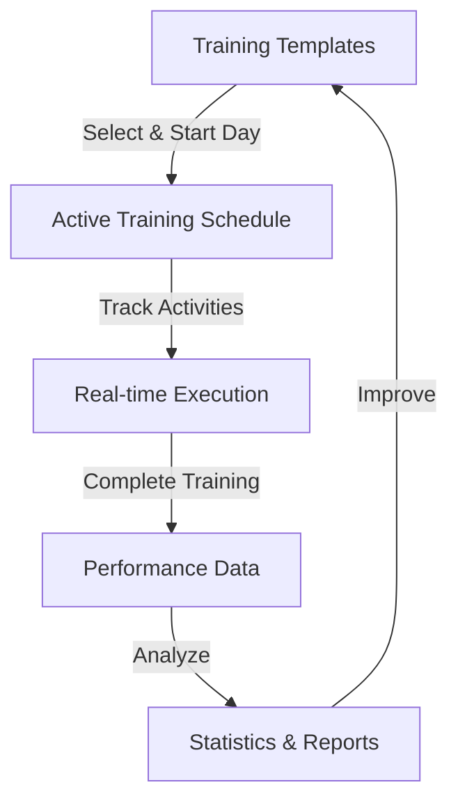
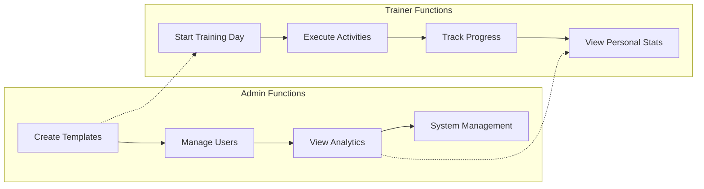

# OnTrak Training Management System 🏋️‍♂️

OnTrak is a comprehensive training management system designed specifically for Learning & Development (L&D) teams to standardize, execute, and analyze training programs across multiple locations. It bridges the gap between training design and delivery by providing real-time tracking, execution support, and performance analytics.

## 📋 What is OnTrak?

OnTrak helps L&D teams solve common training challenges:

- **Standardization**: Ensure consistent training delivery across different locations and trainers
- **Real-time Execution**: Track and manage training activities as they happen
- **Performance Analysis**: Measure adherence to training plans and identify improvement areas
- **Multi-location Support**: Manage training across different timezones and locations



## 🎯 Benefits for L&D Teams

| Challenge | OnTrak Solution | Business Impact |
|-----------|-----------------|-----------------|
| Inconsistent training delivery | Standardized templates with precise timing | Improved training quality and outcomes |
| Difficulty tracking adherence | Real-time activity tracking | Better compliance and quality control |
| Limited visibility into training execution | Comprehensive statistics and reporting | Data-driven training improvements |
| Managing training across locations | Multi-timezone support | Consistent global training operations |
| Manual training administration | Digital tracking and reporting | Reduced administrative overhead |
| Training program improvements | Performance analytics | Continuous improvement of training programs |

## 🌟 Key Features

- **Template Management**
  - Create reusable training plans with day-by-day activities
  - Organize activities with precise timing requirements
  - Tag and categorize templates for easy discovery

- **Training Execution**
  - Start training days from templates with one click
  - Navigate through activities with clear timing guidance
  - Track actual vs. planned timing for each activity

- **Performance Analytics**
  - Measure adherence to training schedules
  - Analyze timing variances (early/on-time/late)
  - Compare performance across trainers and programs

- **User Management**
  - Role-based access (Admin/Trainer)
  - Location-based settings with timezone support
  - Secure authentication system



## 💻 Technical Overview

- **Frontend**: React, TypeScript, Shadcn UI components
- **Backend**: Node.js, Express, MongoDB
- **Real-time Updates**: WebSocket integration
- **Deployment**: Docker containerization

## 🏗️ Project Structure

```
ontrak/
├── client/               # Frontend application
│   ├── src/              # Source code
│   │   ├── components/   # React components
│   │   ├── contexts/     # React contexts
│   │   ├── pages/        # Page components
│   │   ├── services/     # API services
│   │   └── utils/        # Utility functions
│   ├── public/           # Static files
│   └── Dockerfile        # Frontend container config
│
├── server/               # Backend application
│   ├── src/              # Source code
│   │   ├── config/       # Configuration files
│   │   ├── models/       # Database models
│   │   ├── routes/       # API routes
│   │   └── utils/        # Utility functions
│   ├── database/         # MongoDB data directory
│   ├── logs/             # Application logs
│   └── Dockerfile        # Backend container config
│
├── scripts/              # Utility scripts
├── database/             # Database files
├── documentations/       # Project documentation
└── docker-compose.yml    # Container orchestration
```

## 🚀 Getting Started

### Prerequisites

- Node.js (v16 or higher) 📦
- MongoDB (v4.4 or higher) 🗄️
- Docker (optional, for containerized deployment) 🐳

### Development Setup

1. **Clone the repository:**
   ```bash
   git clone https://github.com/yourusername/ontrak.git
   cd ontrak
   ```

2. **Set up environment variables:**
   - Copy `.env.example` to `.env`
   - Update the variables as needed
   ```bash
   cp .env.example .env
   ```

3. **Install dependencies:**
   ```bash
   # Install backend dependencies
   cd server
   npm install

   # Install frontend dependencies
   cd ../client
   npm install
   ```

4. **Start MongoDB:**
   - macOS: `brew services start mongodb-community`
   - Linux: `sudo systemctl start mongod`
   - Windows: MongoDB runs as a Windows Service

5. **Start development servers:**
   ```bash
   # Start backend (from server directory)
   npm run dev

   # Start frontend (from client directory)
   npm start
   ```

The application will be available at:
- Frontend: http://localhost:3000
- Backend: http://localhost:3456

### Production Deployment (Docker) 🐳

OnTrak uses two containers in production:

1. **Frontend Container:**
   - Nginx server serving the React application
   - Exposed on port 3000
   - Optimized build with minimal footprint

2. **Backend Container:**
   - Node.js server running the API
   - Exposed on port 3456
   - Includes automatic backup system
   - Handles database connections

To deploy using Docker:

```bash
# Build and start containers
docker-compose up -d

# View logs
docker-compose logs -f
```

The application will be available at:
- Frontend: http://your-ip:3000
- Backend: http://your-ip:3456

## 📁 Volume Mounts

Docker deployment uses the following volume mounts:

- `/app/logs`: Application logs
- `/app/backups`: Database backups
- `/app/database`: MongoDB data
- `/.env`: Environment configuration

## 🔧 Configuration

Key environment variables:

- `NODE_ENV`: Application environment (development/production)
- `CLIENT_URL`: Frontend application URL
- `BACKEND_URL`: Backend API URL
- `MONGODB_URI`: MongoDB connection string
- `JWT_SECRET`: Secret key for authentication

See `.env.example` for all available options.

## 🛡️ Security Features

- JWT-based authentication
- Role-based access control
- Rate limiting
- Secure password hashing
- Input validation
- Error logging

## 📊 Monitoring

- Application logs in `/server/logs`
- MongoDB database backups in `/server/backups`
- Error tracking and reporting
- Performance monitoring

## 🔄 Backup Management
- Daily backups are stored in a separate backup location
- Keep last 7 daily backups
- Keep last 4 weekly backups
- Keep last 3 monthly backups

## 🤝 Contributing

1. Fork the repository
2. Create your feature branch
3. Commit your changes
4. Push to the branch
5. Create a Pull Request

## 🆘 Support

For support, please contact:
- Email: support@ontrak.com
- Issues: GitHub Issues page

## 🙏 Acknowledgments

- MongoDB team
- React team
- Node.js community
- All contributors
