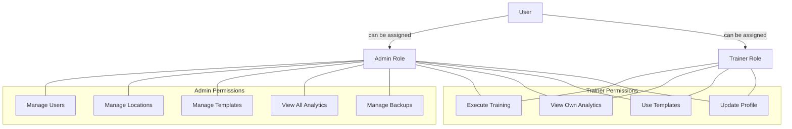
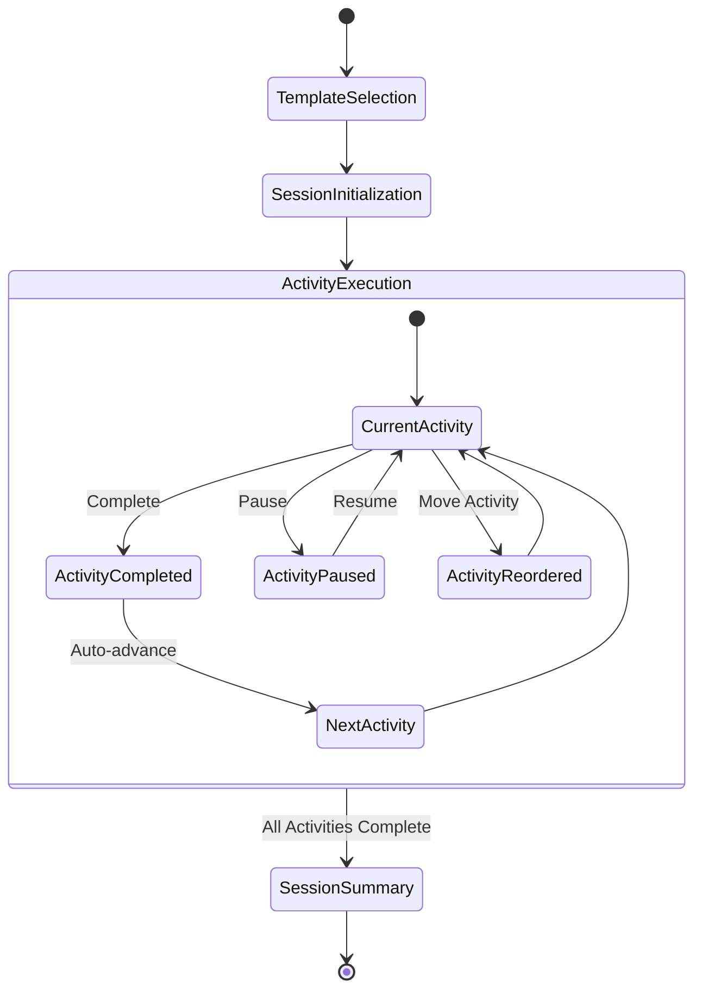
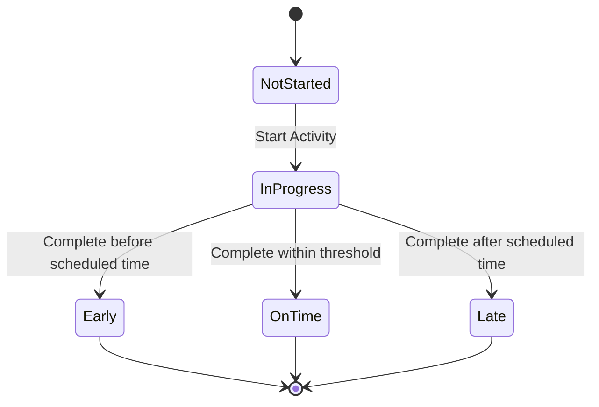
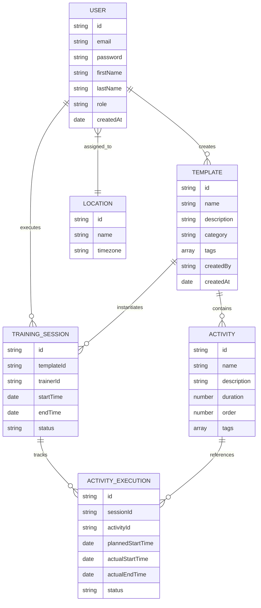
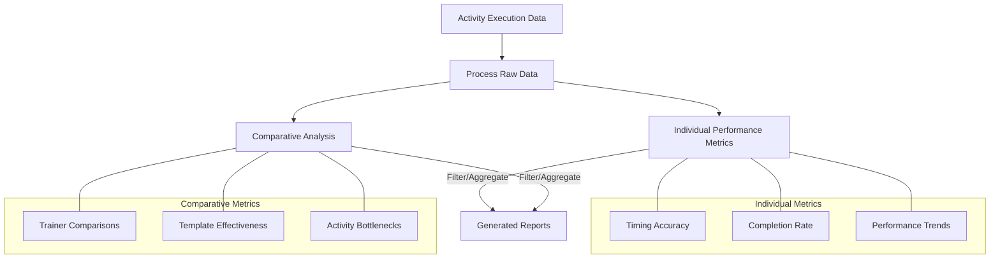
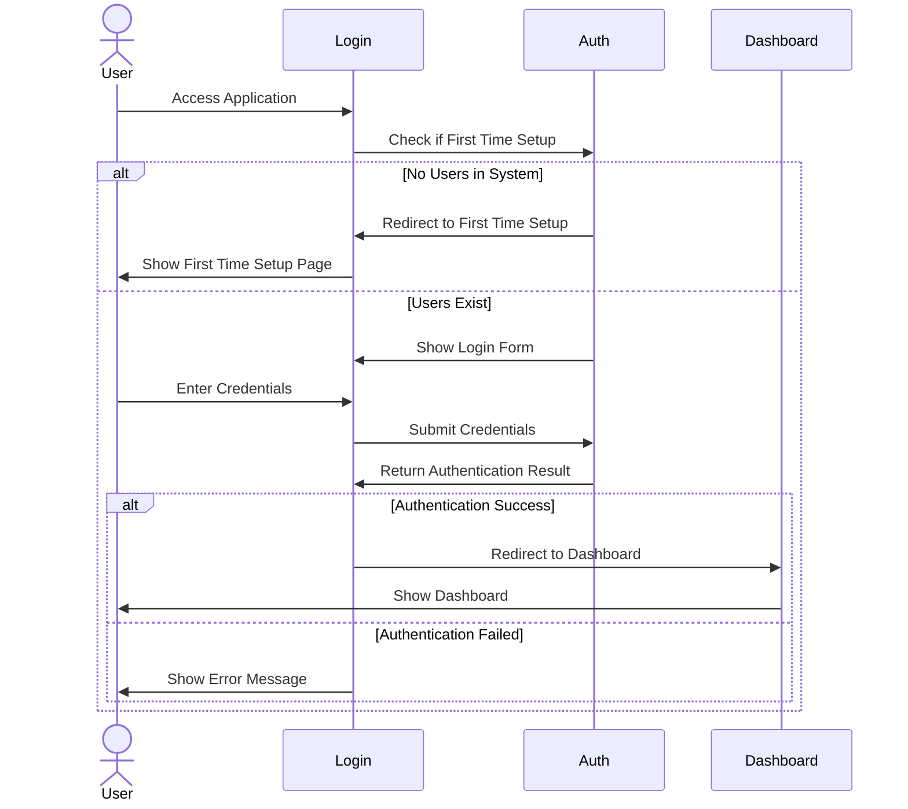
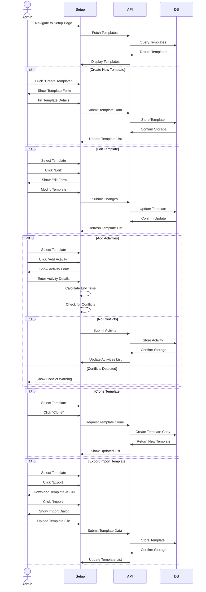
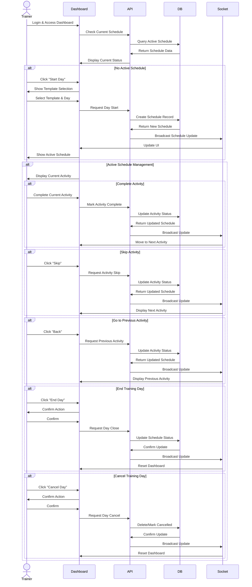
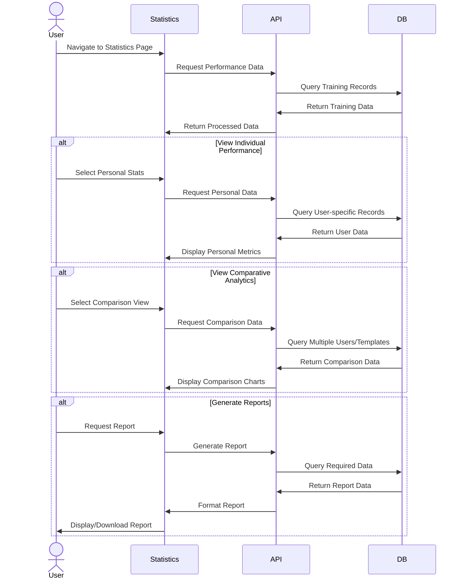

# OnTrak Application - Functional Requirements

This document outlines the core functionality of the OnTrak training management application. It serves as a reference for developers implementing these features in the new technology stack.

## 1. User Authentication & Management

### 1.1 Authentication
- **User Registration**: Allow new users to create accounts with email, password, and profile details
- **User Login**: Authenticate users with email and password
- **Password Reset**: Enable users to reset forgotten passwords
- **Session Management**: Create, validate, and expire user sessions
- **Token Refresh**: Automatically refresh authentication tokens

### 1.2 User Profile
- **View Profile**: Display user's personal information and settings
- **Edit Profile**: Allow users to update personal information
- **Change Password**: Permit users to update their password
- **Account Settings**: Configure user-specific application settings

### 1.3 Role-Based Access
- **Role Assignment**: Assign roles to users (Admin/Trainer)
- **Permission Validation**: Verify user permissions for specific actions
- **Role-Specific UI**: Display different interface options based on user role

## 2. Template Management

### 2.1 Training Templates
- **Create Template**: Define new training plans with activities and timing
- **Edit Template**: Modify existing training templates
- **Delete Template**: Remove templates from the system
- **Clone Template**: Create copies of existing templates for modification
- **Template Categories**: Organize templates into categories
- **Template Search**: Find templates by name, category, or tag

### 2.2 Activity Management
- **Add Activities**: Create activities within templates
- **Define Timing**: Set precise timing requirements for each activity
- **Order Activities**: Arrange activities in sequence
- **Activity Dependencies**: Set prerequisites between activities
- **Activity Descriptions**: Add detailed instructions for each activity
- **Activity Tags**: Label activities for categorization and filtering

## 3. Training Execution

### 3.1 Training Session Management
- **Start Training**: Initialize a training session from a template
- **End Training**: Complete and finalize a training session
- **Pause/Resume**: Temporarily halt and continue training sessions
- **Reset Training**: Restart a training session
- **Move Activity**: Change the order of activities during the training session

### 3.2 Activity Tracking
- **Start Activity**: Begin tracking time for a specific activity
- **Complete Activity**: Mark activities as finished
- **Track Timing**: Record actual timing versus planned timing
- **Activity Navigation**: Move between activities in sequence
- **Progress Indicators**: Display completion status for activities

### 3.3 Real-Time Tracking
- **Live Updates**: Provide real-time timing information
- **Status Indicators**: Show early/on-time/late status for activities
- **Next Activity Preview**: Display upcoming activities in the sequence
- **Time Alerts**: Notify when activities are approaching time limits

## 4. Performance Analytics

### 4.1 Individual Performance
- **Timing Analysis**: Measure adherence to scheduled activity times
- **Completion Rates**: Track percentage of completed activities
- **Performance Trends**: Show improvement or decline over time
- **Personal Statistics**: Provide user-specific performance data

### 4.2 Comparative Analytics
- **Trainer Comparison**: Compare performance metrics across trainers
- **Template Effectiveness**: Evaluate the success rates of different templates
- **Time Variance Reports**: Analyze early/on-time/late patterns
- **Activity Bottlenecks**: Identify consistently problematic activities

### 4.3 Reporting
- **Generate Reports**: Create standardized performance reports
- **Export Data**: Extract analytics in various formats (CSV, PDF)
- **Scheduled Reports**: Set up automatic report generation
- **Custom Metrics**: Define and track personalized performance indicators

## 5. Admin Functions

### 5.1 User Administration
- **User Directory**: View and search all system users
- **Create Users**: Add new users with specified roles
- **Edit User Details**: Modify user information and settings
- **Deactivate Users**: Temporarily disable user accounts
- **Delete Users**: Permanently remove users from the system

### 5.2 Location Management
- **Add Locations**: Create new training locations
- **Timezone Configuration**: Set location-specific time settings
- **Location Assignment**: Assign users to specific locations
- **Location-Based Reporting**: Filter analytics by location

## 6. System Management

### 6.1 Backup & Recovery
- **Automated Backups**: Schedule regular data backups
- **Backup Management**: View, create, and restore backups

## 7. System Diagrams

### 7.1 User Role & Permission Model

### 7.2 Training Execution Flow

### 7.3 Activity Timing States

### 7.4 Data Relationship Model

### 7.5 Performance Analytics Flow

## 8. Key User Journeys

### 8.1 User Authentication Flow

### 8.2 Template Management Journey

### 8.3 Training Execution Journey

### 8.4 Analytics Review Journey

